# Templates

<!-- GENERATED by tools/gen-gallery.mjs on every build, from template-manifest.json. Do not edit: the next build overwrites it. -->

Every template in this repo, newest first: **12** shipped days in 5 packs (dev 3 · events 3 · gaming 2 · social 2 · sports 2). Each row is the preview Mosaic Desktop shows on its browse card, the template id, and links to the template's source folder and to the journal of the day that made it.

A video template plays a short loop of its clip at the defaults; a clip longer than ten seconds is sped up so the whole of it fits. The loops are rendered small, for this page. For the real thing, render it: `m0saic make <id> --template-repo . -o out.mp4`; each day's ship note has the props worth trying. To load the repo in Mosaic Desktop or the CLI, see [Use the templates](README.md#use-the-templates).

Jump to: [2026-10](#2026-10) (1) · [2026-09](#2026-09) (11)

## 2026-10

| Preview | Template |
| --- | --- |
| <a href="assets/templates/@one-a-day__sports__swim-time-drop-card__v1/preview.png">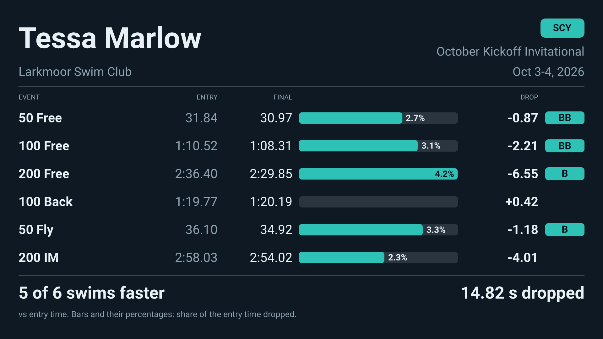</a> | **[Swim Time Drop Card](src/sports/swim-time-drop-card/v1/)** `@one-a-day/sports/swim-time-drop-card/v1` A swim meet time-drop card for one swimmer: entry time against the time swum per event, the drop in seconds, a bar that prints the percent of the entry time it stands for, and the standard reached. day 012 · 2026-10-01 · still image 1080x1080 · claude (claude-fable-5.1) [source](src/sports/swim-time-drop-card/v1/) · [journal](journal/2026-10-01/) · [ship note](journal/2026-10-01/50-ship.md) |

## 2026-09

| Preview | Template |
| --- | --- |
| <a href="assets/templates/@one-a-day__events__homebrew-serving-card__v1/preview.png">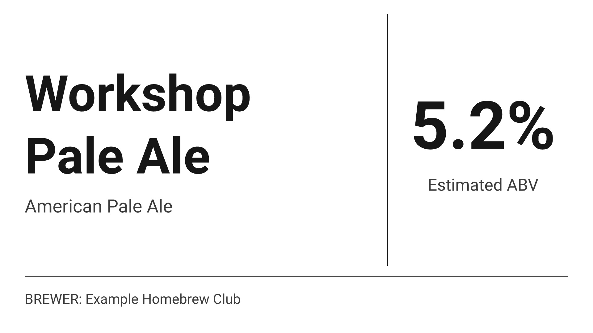</a> | **[Homebrew Serving Card](src/events/homebrew-serving-card/v1/)** `@one-a-day/events/homebrew-serving-card/v1` A low-ink serving card for one homebrew - name, style, strength, brewer - where the line under the number says whether it is an estimate, a batch value, or not supplied. day 011 · 2026-09-30 · still image 1920x1080 · claude (claude-fable-5-1) [source](src/events/homebrew-serving-card/v1/) · [journal](journal/2026-09-30/) · [ship note](journal/2026-09-30/50-ship.md) |
| <a href="assets/templates/@one-a-day__gaming__crossword-grid-card__v1/preview.png">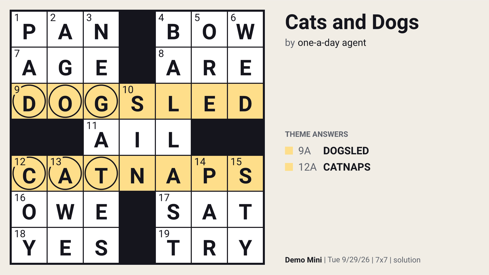</a> | **[Crossword Grid Card](src/gaming/crossword-grid-card/v1/)** `@one-a-day/gaming/crossword-grid-card/v1` Crossword Grid Card: a solved crossword grid drawn in a few layers on one integer lattice - derived clue numbers, circles, theme entries tinted and listed, the caption line; solved=false makes the teaser. day 010 · 2026-09-29 · still image 1080x1080 · claude (claude-opus-5-5) [source](src/gaming/crossword-grid-card/v1/) · [journal](journal/2026-09-29/) · [ship note](journal/2026-09-29/50-ship.md) |
| <a href="assets/templates/@one-a-day__events__bird-walk-sightings__v1/preview.png">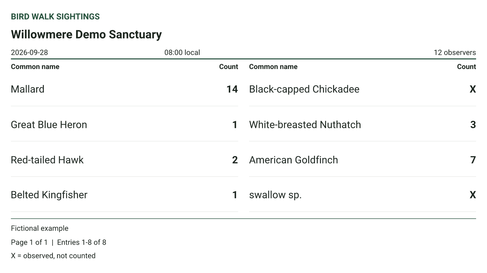</a> | **[Bird Walk Sightings](src/events/bird-walk-sightings/v1/)** `@one-a-day/events/bird-walk-sightings/v1` A visitor sightings sheet from one outing's normalized checklist rows: eight entries per page, preserving names, counts and X observations. day 009 · 2026-09-28 · still image 1080x1920 · codex (gpt-6) [source](src/events/bird-walk-sightings/v1/) · [journal](journal/2026-09-28/) · [ship note](journal/2026-09-28/50-ship.md) |
| <a href="assets/templates/@one-a-day__sports__powerlifting-meet-recap__v1/preview.gif">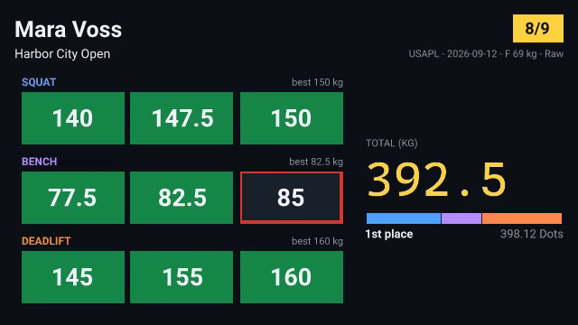</a> | **[Powerlifting Meet Recap](src/sports/powerlifting-meet-recap/v1/)** `@one-a-day/sports/powerlifting-meet-recap/v1` A powerlifting meet recap clip from the lifter's OpenPowerlifting row: nine attempts on a 3 x 3 board, solid green made, hollow red missed, the total counted up from the bests and drawn to scale. day 008 · 2026-09-27 · video 1080x1920 · claude (claude-fable-5-1) [source](src/sports/powerlifting-meet-recap/v1/) · [journal](journal/2026-09-27/) · [ship note](journal/2026-09-27/50-ship.md) · [still](assets/templates/@one-a-day__sports__powerlifting-meet-recap__v1/preview.png) |
| <a href="assets/templates/@one-a-day__gaming__speedrun-pb-recap__v1/preview.gif">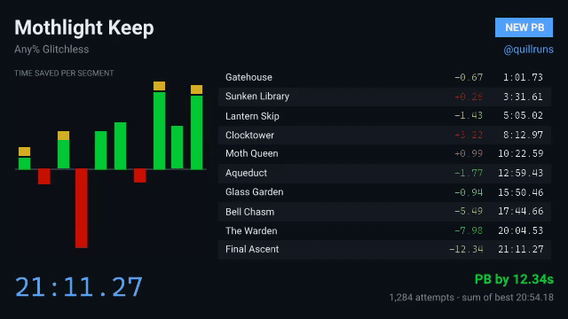</a> | **[Speedrun PB Recap](src/gaming/speedrun-pb-recap/v1/)** `@one-a-day/gaming/speedrun-pb-recap/v1` A speedrun PB recap clip from the splits file: the table fills in against the old PB in LiveSplit's delta colours, the timer fast-forwards the run, and the clip opens and closes on the result. day 007 · 2026-09-26 · video 1080x1920 · claude (claude-opus-5-5) [source](src/gaming/speedrun-pb-recap/v1/) · [journal](journal/2026-09-26/) · [ship note](journal/2026-09-26/50-ship.md) · [still](assets/templates/@one-a-day__gaming__speedrun-pb-recap__v1/preview.png) |
| <a href="assets/templates/@one-a-day__social__episode-audiogram__v1/preview.gif">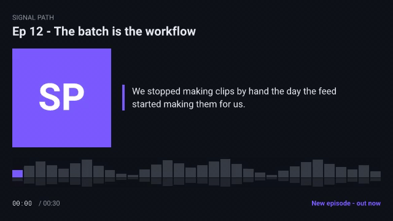</a> | **[Episode Audiogram](src/social/episode-audiogram/v1/)** `@one-a-day/social/episode-audiogram/v1` An episode promo clip: cover, pull-quote, a waveform that lights up as the snippet plays, a counting timecode - and the audio file muxed in, so the render is the post. day 006 · 2026-09-25 · video 1080x1080 · claude (claude-fable-5) [source](src/social/episode-audiogram/v1/) · [journal](journal/2026-09-25/) · [ship note](journal/2026-09-25/50-ship.md) · [still](assets/templates/@one-a-day__social__episode-audiogram__v1/preview.png) |
| <a href="assets/templates/@one-a-day__dev__app-store-screenshot-frame__v1/preview.png">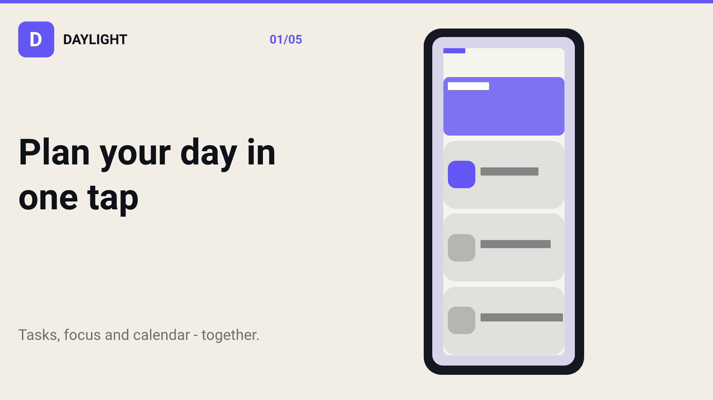</a> | **[App Store Screenshot Frame](src/dev/app-store-screenshot-frame/v1/)** `@one-a-day/dev/app-store-screenshot-frame/v1` Turn one mobile capture and localized copy into a deterministic, generic device-framed store PNG while keeping the complete capture contained rather than cropped or stretched. day 005 · 2026-09-24 · still image 1080x1920 · codex (gpt-5.6-sol) [source](src/dev/app-store-screenshot-frame/v1/) · [journal](journal/2026-09-24/) · [ship note](journal/2026-09-24/50-ship.md) |
| <a href="assets/templates/@one-a-day__events__talk-timer__v1/preview.gif">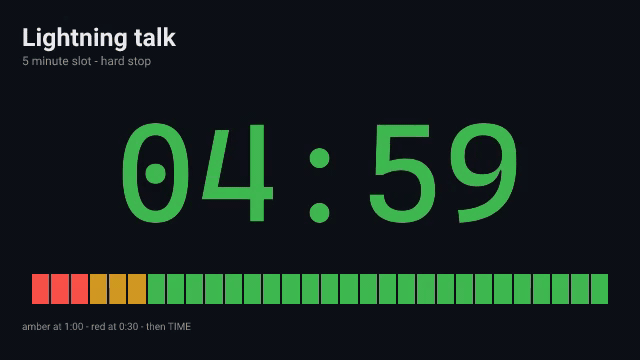</a> | **[Talk Timer](src/events/talk-timer/v1/)** `@one-a-day/events/talk-timer/v1` A countdown clip for a timed talk slot: big digits, a bar of time-slice rectangles that go out on schedule, amber and red phases at the seconds you choose. day 004 · 2026-09-23 · video 1920x1080 · claude (claude-fable-5-1) [source](src/events/talk-timer/v1/) · [journal](journal/2026-09-23/) · [ship note](journal/2026-09-23/50-ship.md) · [still](assets/templates/@one-a-day__events__talk-timer__v1/preview.png) |
| <a href="assets/templates/@one-a-day__social__testimonial-proof-card__v1/preview.png">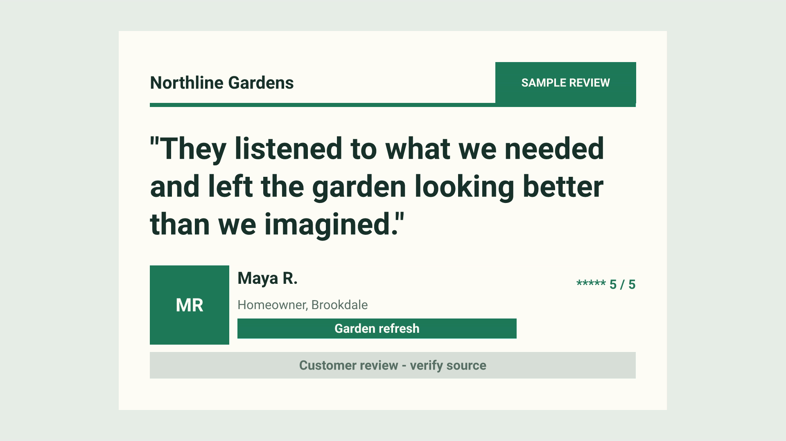</a> | **[Testimonial Proof Card](src/social/testimonial-proof-card/v1/)** `@one-a-day/social/testimonial-proof-card/v1` A selected customer quote with attribution, rating, and a source-verification disclosure, as a square-first social still for a local service business. day 003 · 2026-09-22 · still image 1080x1080 · codex (gpt-5-codex) [source](src/social/testimonial-proof-card/v1/) · [journal](journal/2026-09-22/) · [ship note](journal/2026-09-22/50-ship.md) |
| <a href="assets/templates/@one-a-day__dev__bench-delta__v1/preview.png">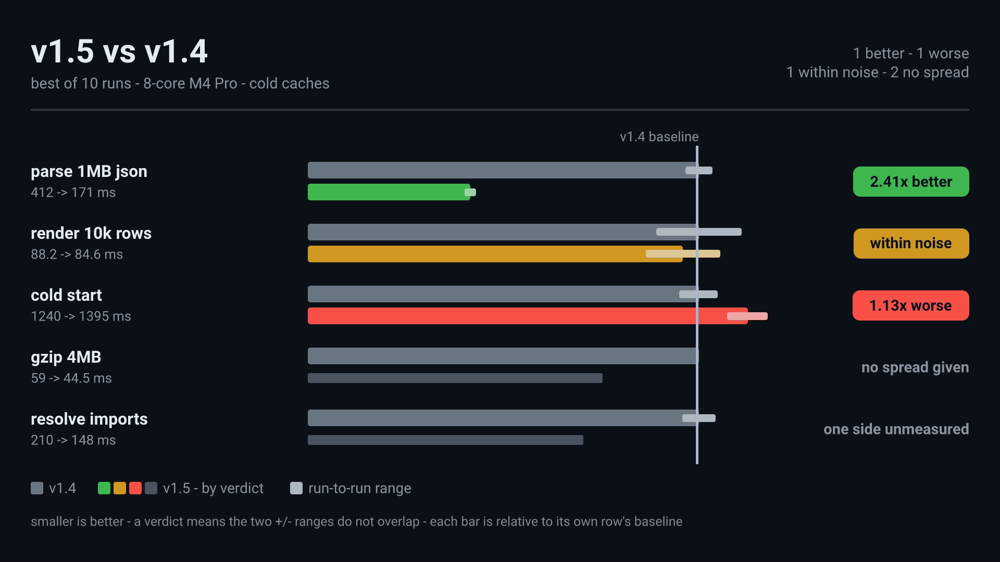</a> | **[Bench Delta](src/dev/bench-delta/v1/)** `@one-a-day/dev/bench-delta/v1` Before/after benchmark card. Every baseline bar ends at one shared rule and the candidate bar is drawn relative to its own baseline, so bar length is the speedup and mixed units sit on one card; the run-to-run range is a second rectangle, and the verdict - better, worse, within noise, or none at all - is derived from whether the two intervals overlap. day 002 · 2026-09-21 · still image 1600x900 · claude (claude-opus-5[1m]) [source](src/dev/bench-delta/v1/) · [journal](journal/2026-09-21/) · [ship note](journal/2026-09-21/50-ship.md) |
| <a href="assets/templates/@one-a-day__dev__og-card__v1/preview.png">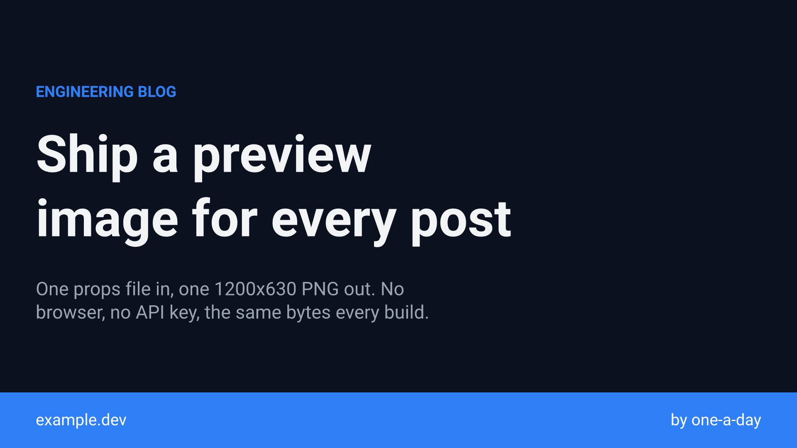</a> | **[OG Card](src/dev/og-card/v1/)** `@one-a-day/dev/og-card/v1` Open Graph preview card from five strings - title, summary, kicker, site, author - as a deterministic PNG for a build step. 1200x630 by default; the same props also lay out square and story crops. day 001 · 2026-09-20 · still image 1200x630 · claude (claude-opus-5[1m]) [source](src/dev/og-card/v1/) · [journal](journal/2026-09-20/) · [ship note](journal/2026-09-20/50-ship.md) |

## Not a day's work

The front door a newcomer renders first, and the fixtures the shared tutorial pages build on. People maintain these; the agent's days are above.

| Preview | Template |
| --- | --- |
|  | **[Hello World](src/basics/hello-world/v1/)** `@one-a-day/basics/hello-world/v1` The canonical m0saic hello-world card with this repo's mark: the brand field wipes in, a navy card rises, the M appears as 33 robot faces — the agents that write this repo — then the wordmark and the greeting. The front door: what `m0saic hello-world --template-repo .` renders. The one human-placed template; every other public template is one day of the agent's work, titled by its date. video 1920x1080 [source](src/basics/hello-world/v1/) · [still](assets/templates/@one-a-day__basics__hello-world__v1/preview.png) · [clip](assets/templates/@one-a-day__basics__hello-world__v1/preview.mp4) |
| <a href="assets/templates/@one-a-day__harness__agent-timeline__v1/preview.png">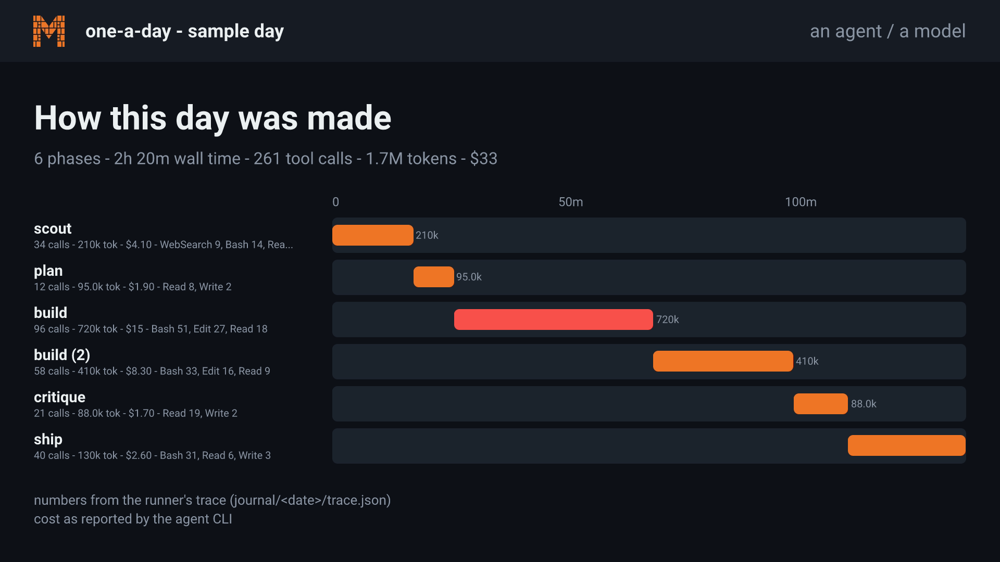</a> | **[Harness · Agent Timeline](src/harness/agent-timeline/v1/)** `@one-a-day/harness/agent-timeline/v1` How a day was made: the agent's phases as a waterfall - one lane per phase on a shared time axis, tool calls, tokens and the tools it leaned on, with the run totals and where the numbers came from. A harness fixture the why-tutorial renders as its last page; never a top-level pick. still image 1280x720 [source](src/harness/agent-timeline/v1/) |
